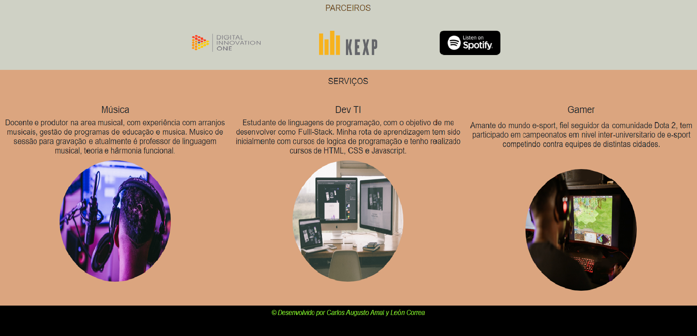

# Meu site com bootstrap
Esse é um modelo de site propio que realizei a partir do bootstrap

foram utilizadas:

- HTML
- CSS/Bootstrap

Na parte superior da página há um menu de 3 opções , ao clicar em qualquer uma das opções levara você diretamente para a tela dessa opção. 

Embaixo uma foto de exempl ao clican na opção "Quem sou eu?"

Ao clicar nas outros dos opções, aparecerão as seguintes informações apresentadas na imagem embaixo.

